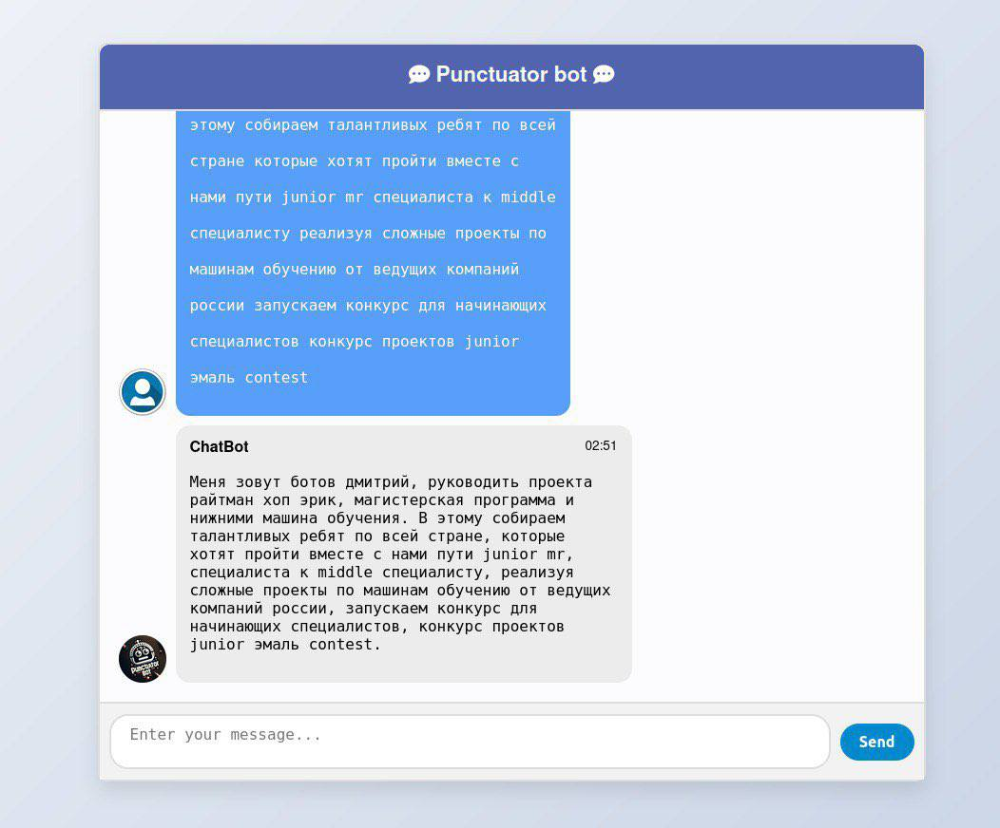

# Punctuator Bot

Punctuator Bot is a revolutionary tool designed to enhance the readability of auto-generated scripts on YouTube by accurately restoring missing punctuation. This AI-powered bot processes the raw, punctuation-less text from YouTube's auto-generated scripts and intelligently inserts commas, periods, question marks, and more, making the text easier to read and understand.

## Features

- **Automatic Punctuation Restoration**: Automatically adds punctuation to auto-generated YouTube scripts.
- **Supports Multiple Languages**: Initially supports Russian, with plans to expand to other languages.
- **User-friendly Interface**: Simple and intuitive interface for both technical and non-technical users.
- **High Accuracy**: Utilizes advanced NLP techniques to ensure high punctuation accuracy.

## Sample

